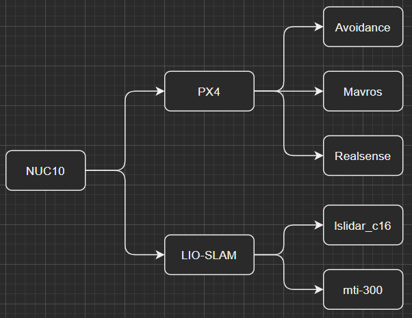

# tsinghua-SLAM

记录SLAM一些paper, 直接用在无人机上

----

系统环境： 
- Ubuntu18.04.5 LTS x86_64 
- Kernel: 5.4.0-80-generic
- ROS melodic 1.14.11
  
硬件：
- NUC8 i7-8650U & NUC10 i7-10710U
- 镭神激光雷达 C16 / Velodyne VPL-16
- Xsens Mti-300
- 路由器: AR750S
- 飞控: PX4

----
## 传送门

- [Note](note.md)     
- [Development](development.md)       
- [Data](data/README.md)  

----
## 系统框架图

## 框架介绍

## PX4 
代表无人机项目, 子项目有`Avoidance` + `Mavros` + `Realsense`     

`Avoidance` 是无人机自动避障        
`Mavros` 是PX4飞控和ROS环境的桥梁, 通过串口     
`Realsense`是intel深度相机的工作空间, 负责测距, 配合`Avoidance`使用

## LIO-SLAM
代表3D SLAM建模项目, 子项目有`lslidar_c16` + `mti-300`

`lslidar_c16` 是激光雷达ROS工作空间     
`mti-300` 是九轴IMU ROS工作空间

配置环境需要仔细阅读文档 [development](development.md)

----
## SLAM Table

| SLAM Algorithm with Github                                       | Mechanism | Appendix & Paper                                |
| :--------------------------------------------------------------- | :-------- | :---------------------------------------------- |
| [LIO-SAM](https://github.com/TixiaoShan/LIO-SAM)                 | CMU       | [Paper: LOAM][Paper: LOAM-L]                    |
| [LVI-SAM](https://github.com/TixiaoShan/LVI-SAM)                 | CMU       | [Paper: LVI-SAM][Paper: LVI-SAM-L]              |
| [A-LOAM](https://github.com/HKUST-Aerial-Robotics/A-LOAM)        | HKUST     |                                                 |
| [FAST-LIO](https://github.com/gisbi-kim/SC-A-LOAM)               | KAIST     |                                                 |
| [LeGO-LOAM](https://github.com/RobustFieldAutonomyLab/LeGO-LOAM) | Stevens   | [LeGO-分析][知乎LeGO-L] & [LeGO-初探][BlogLeGO-L] |
| [SC-LeGO-LOAM](https://github.com/irapkaist/SC-LeGO-LOAM)        | KAIST     | [Github: 中文注释][Github中文注释-L]              |
| [XCHU-SLAM](https://github.com/JokerJohn/xchu_slam)              | Beihang   | [3D激光SLAM系统][知乎3D激光SLAM系统-L]             |
| [LOAM-LIVOX](https://github.com/hku-mars/loam_livox)             | HKU       |                                                 |
| [RPG-SVO-PRO-OPEN](https://github.com/uzh-rpg/rpg_svo_pro_open)  | UZH       |                                                 |
     
----
## 数据集下载: 
[Visual Odometry / SLAM Evaluation 2012](http://www.cvlibs.net/datasets/kitti/eval_odometry.php)        
[jackal_dataset](https://github.com/RobustFieldAutonomyLab/jackal_dataset_20170608)  
## 数据集使用:
Github: [file_player_mulran](https://github.com/irapkaist/file_player_mulran)    
Youtube: [How to run MulRan ROS file player](https://www.youtube.com/watch?v=uU-FC-GmHXA&t=45s)

## 相关论文:
[ICRA2021 Paper](https://github.com/MistyMoonR/ICRA2021-SLAM-paper-list)        
ICRA 论文介绍: https://zhuanlan.zhihu.com/p/388715878       

----

## 硬件相关:
### intel D435i 双目摄像头相关
Github: [librealsense](https://github.com/IntelRealSense/librealsense/releases/tag/v2.45.0)      
ROS: [realsense-ros](https://github.com/IntelRealSense/realsense-ros)

### Velodyne 16线激光雷达:     
Github:  [velodyne](https://github.com/ros-drivers/velodyne.git)        
ROS wiki: [Getting Started with the Velodyne VLP16](http://wiki.ros.org/velodyne/Tutorials/Getting%20Started%20with%20the%20Velodyne%20VLP16)

### 镭神激光雷达 C16:    
Github:  [lslidar_c16](https://github.com/tianb03/lslidar_c16)      
博客: [镭神激光雷达官方驱动安装适配](https://www.jianshu.com/p/d8efdf333e98)

### 九轴IMU - Spatial:     
Official website: [Spatial](https://www.advancednavigation.com/products/spatial)        
ROS wiki: [advanced_navigation_driver](http://wiki.ros.org/advanced_navigation_driver)   

----
[Paper: LOAM-L]:paper/LOAM:%20Lidar%20Odometry%20and%20Mapping%20in%20Real-time.pdf
[Paper: LVI-SAM-L]:paper/LVI-SAM.pdf
[知乎LeGO-L]:https://zhuanlan.zhihu.com/p/382460472
[BlogLeGO-L]:https://blog.csdn.net/learning_tortosie/article/details/86527542
[Github中文注释-L]:https://github.com/wykxwyc/LeGO-LOAM_NOTED
[知乎3D激光SLAM系统-L]:https://zhuanlan.zhihu.com/p/374933500