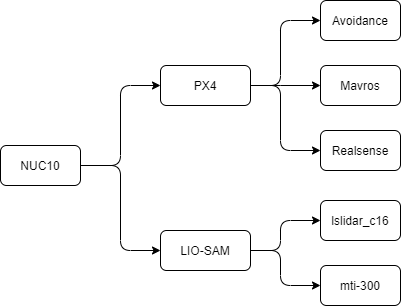

# tsinghua-PX4-ROS-README

A lot of things were removed during development, clone this file is recommended `depth=1`

```bash
git clone --depth=1 https://github.com/MistyMoonR/tsinghua-SLAM.git
```

----
System environment: 
- Ubuntu18.04.5 LTS x86_64 
- Kernel: 5.4.0-80-generic
- ROS melodic 1.14.11
  
Hardware：
- NUC8 i7-8650U & NUC10 i7-10710U
- leishen LiDAR C16
- Camera: RealSense D455 & D435i
- Xsens Mti-300
- Routers: AR750S
- Flight Control: Pixhawk 4
- A drone


----
## Portal

- [Note](note.md)     
- [Development](development.md)       
- [Data](data/README.md)  

----
## System framework diagram




## Introduction to the framework

## PX4 
Representing the UAV PX4 flight control, the sub-projects are `Avoidance` + `Mavros` + `Realsense`       

`Avoidance` is automatic obstacle avoidance for drones        
`Mavros` is the bridge between the PX4 flight control and the ROS environment, via the serial port     
`Realsense` is the working space for the intel depth camera, responsible for ranging, used in conjunction with `Avoidance`

## LIO-SLAM
On behalf of the 3D SLAM modelling project, the sub-projects are `lslidar_c16` + `mti-300`

`lslidar_c16` It's a LiDAR ROS workspace       
`mti-300` It is a 9-axis IMU ROS workspace PS: It was discovered later that the PX4 comes with a nine-axis IMU, this part can be omitted, if you are a beginner, it is advisable to have a high frequency nine-axis IMU, 200Hz or more.

----

**Configuration of the environment requires careful reading of the documentation [development](development.md)**

----
## Document description  

### SLAM Lidar section: 
[LIO-SAM-dev](SLAM/LIO-SAM-dev.md)  LIO-SAM ROS open source project environment configuration     
[LIO-SAM-note](SLAM/LIO-SAM-note.md) LIO-SAM ROS open source project documentation, including LIO-SAM usage on ROS machines, configuration files, problem solutions, etc.

### PX4 flight control section:  
[Autopilot](PX4/Autopilot.md): PX4/Autopliot PX4 ROS open source project , including Mavros and so on, we recommend that newcomers start from the official tutorials        
[Avoidance-dev](PX4/Avoidance-dev.md): PX4/Avoidance avoidance open source project environment configuration           
[Avoidance-note](PX4/Avoidance-note.md):  PX4/Avoidance avoidance open source project documentation, including avoidance in ROS machine usage, problem solving and scripting , etc.     

### data & doc
The documentation for the hardware used in my project is included inside and is organised so that you can see it as you need it.
This includes but is not limited to

[lslidar_c16](data/lslidar_c16.md)      
[MTi-300](data/MTi-300.md)      
[RealSense](data/RealSense.md)      
[rosbag](data/rosbag.md)        
[Spatial](data/Spatial.md)      
[Velodyne_16](data/Velodyne_16.md)      

### scripts
There are two types, one for configuring the ROS environment and one for running ROS programs             
Most scripts have the appropriate documentation to require the use of

----
## SLAM Table


| SLAM Algorithm with Github                                       | Mechanism | Appendix & Paper                                |
| :--------------------------------------------------------------- | :-------- | :---------------------------------------------- |
| [LIO-SAM](https://github.com/TixiaoShan/LIO-SAM)                 | CMU       | [Paper: LOAM][Paper: LOAM-L]                    |
| [LVI-SAM](https://github.com/TixiaoShan/LVI-SAM)                 | CMU       | [Paper: LVI-SAM][Paper: LVI-SAM-L]              |
| [A-LOAM](https://github.com/HKUST-Aerial-Robotics/A-LOAM)        | HKUST     |                                                 |
| [FAST-LIO](https://github.com/gisbi-kim/SC-A-LOAM)               | KAIST     |                                                 |
| [LeGO-LOAM](https://github.com/RobustFieldAutonomyLab/LeGO-LOAM) | Stevens   | [LeGO-Analysis][知乎LeGO-L] & [LeGO-A First Look][BlogLeGO-L] |
| [SC-LeGO-LOAM](https://github.com/irapkaist/SC-LeGO-LOAM)        | KAIST     | [Github: Chinese commentary][Github中文注释-L]              |
| [XCHU-SLAM](https://github.com/JokerJohn/xchu_slam)              | Beihang   | [3D laser SLAM system][知乎3D激光SLAM系统-L]             |
| [LOAM-LIVOX](https://github.com/hku-mars/loam_livox)             | HKU       |                                                 |
| [RPG-SVO-PRO-OPEN](https://github.com/uzh-rpg/rpg_svo_pro_open)  | UZH       |                                                 |
     
----
## Download the dataset: 
[Visual Odometry / SLAM Evaluation 2012](http://www.cvlibs.net/datasets/kitti/eval_odometry.php)        
[jackal_dataset](https://github.com/RobustFieldAutonomyLab/jackal_dataset_20170608)  
## Data set use:
Github: [file_player_mulran](https://github.com/irapkaist/file_player_mulran)    
Youtube: [How to run MulRan ROS file player](https://www.youtube.com/watch?v=uU-FC-GmHXA&t=45s)

## Related papers:
[ICRA2021 Paper](https://github.com/MistyMoonR/ICRA2021-SLAM-paper-list)        
ICRA Introduction: https://zhuanlan.zhihu.com/p/388715878       

----
[Paper: LOAM-L]:paper/LOAM:%20Lidar%20Odometry%20and%20Mapping%20in%20Real-time.pdf
[Paper: LVI-SAM-L]:paper/LVI-SAM.pdf
[知乎LeGO-L]:https://zhuanlan.zhihu.com/p/382460472
[BlogLeGO-L]:https://blog.csdn.net/learning_tortosie/article/details/86527542
[Github中文注释-L]:https://github.com/wykxwyc/LeGO-LOAM_NOTED
[知乎3D激光SLAM系统-L]:https://zhuanlan.zhihu.com/p/374933500
