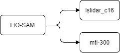

# SLAM-README

系统环境： 
- Ubuntu18.04.5 LTS 
- ROS melodic 1.14.11
- Unitree_Ros change to ROS_ws
----

## SLAM 系统框架图

## SLAM 激光雷达传送门
[LIO-SAM-dev](LIO-SAM-dev.md) LIO-SAM ROS 开源项目环境配置     
[LIO-SAM-note](LIO-SAM-note.md) LIO-SAM ROS 开源项目记录, 包含LIO-SAM在ROS机器上用法, 配置文件, 问题解决方案等等
