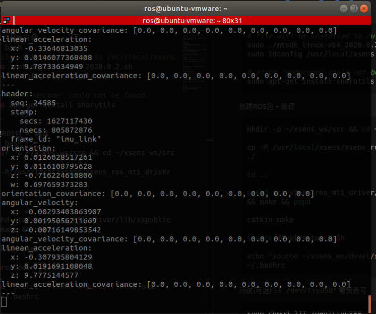
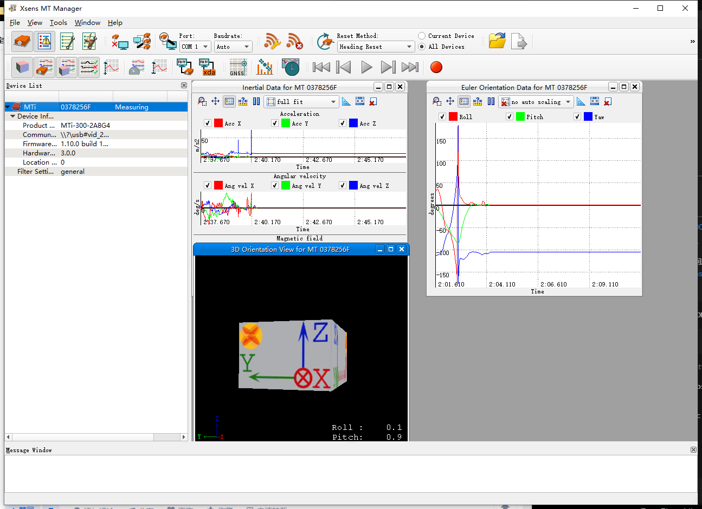

# Xsens MTi-300

系统环境： 
- Ubuntu18.04.5 LTS aarch64
- Kernel 4.9.140-tegra
- ROS melodic 1.14.11

硬件：
- Jetson Xaiver NX
- Velodyne16
----
待解决问题： 
- [ ]  -
----
官网介绍: 
https://www.xsens.com/mti-300

ROS wiki: 
http://wiki.ros.org/xsens_driver

上面ROS wiki来源: (看了下issues里面的问题也是有意思...)
https://github.com/ethz-asl/ethzasl_xsens_driver

**知乎:** https://zhuanlan.zhihu.com/p/385671094

工具下载 MTw Awinda : https://www.xsens.com/software-downloads

----
## ROS安装 (已过测试)
下载并解压
[MT_SoftWare_Suit_For_Linux](xsens/MT_Software_Suite_linux-x64_2019.1.1.tar.gz)

进入目录执行sh
``` bash
# file will be installed to /usr/local/xsens
sudo ./mtsdk_linux-x64_2019.1.1.sh 
sudo ldconfig /usr/local/xsens
```
>问题: <font color='red'> error 'uudecode' could not be found. </font>        

解决方案：
```bash
sudo apt-get install sharutils
```


创建ROS包 + 编译
``` bash
mkdir -p ~/xsens_ws/src && cd ~/xsens_ws/src

cp -R /usr/local/xsens/xsens_ros_mti_driver ./

cd ..

pushd src/xsens_ros_mti_driver/lib/xspublic && make && popd

catkin_make

source devel/setup.bash

echo "source ~/xsens_ws/devel/setup.bash" >> ~/.bashrc
```

测试(可选) `ls /dev/ttyUSB*` 看设备号
``` bash
sudo chmod 777 /dev/ttyUSB0

roslaunch xsens_mti_driver xsens_mti_node.launch

## rviz Fixed Frame: imu_link
```

改参数
``` bash
cd ~/xsens_ws/src/xsens_ros_mti_driver/
vim param/xsens_mti_node.yaml
``` 

`rostopic echo /imu/data`


工具包: `MT_Software_Suite_4.6.0.exe`


----
来源：


