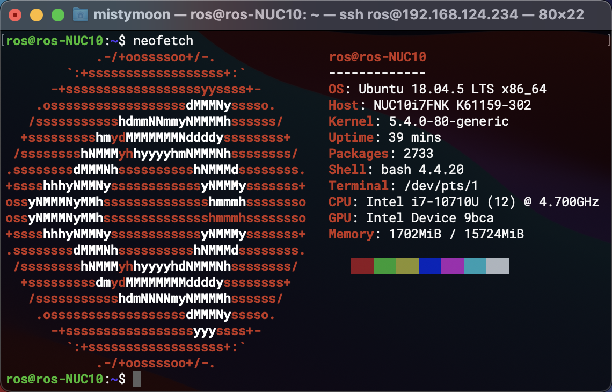

# SLAM

系统环境： 
- Ubuntu18.04.5 LTS x86_64 
- Kernel: 5.4.0-80-generic
- ROS melodic 1.14.11

硬件：
- NUC8 i7-8650U & NUC10 i7-10710U
- 镭神激光雷达 C16
- Xsens Mti-300
- 路由器: AR750S
- 飞控: PX4
----

* [velodyne(可选)](data/Velodyne_16.md)
* [lslidar_c16](data/lslidar_c16.md)
* [advanced_navigation_driver](data/Spatial.md)

问题：
- [x] 文档还未完善,准备链接到ROS那边去

## NUC10

新到手四台NUC10 i7      
**ubuntu18.04 网卡没驱动**      
解决方法: 怼USB免驱网卡 直接点software update软件让它自己更新去，更新好后重启就有了




nuc10 开机过快，加个grub
``` bash
sudo gedit /etc/default/grub
sudo update-grub
```

ubuntu中文输入法方法: [Ubuntu 18.04 配置ibus中文拼音输入法](https://blog.csdn.net/wu10188/article/details/86540464)     

测网速工具 net-tool: `vnstat`

负载测试: 
`stress`   

实测12V DC可用给NUC10供电而且能过stress测试, 需要大电流.

```bash
stress --cpu 12 --timeout 300
```

扩盘神器: `Gparted`
``` bash
sudo apt install gparted
``` 
然后点点点就好了, 去他妈的手敲命令

vscode 提示权限不足问题
```bash
sudo chmod -R 777 xxx_ws
```


----
## ROS melodic
运行 `scripts/ROS-melodic.sh`       
脚本传送门: [ROS-melodic.sh](scripts/ROS-melodic.sh)

## RealSense
手动下载 tar.gz     
按照文档指示来完成: [RealSense](data/RealSense.md)

## QGroundControl
安装方式略麻烦, 具体方式看官网      
官网传送门: [QGC-download and install](https://docs.qgroundcontrol.com/master/en/getting_started/download_and_install.html)


----
# PX4 Avoidance

先决条件: `ROS` + `RealSense` + `Mavros`        
自行阅读文档 [Avoidance](PX4/Avoidance.md)

----
# SLAM

先决条件: `ROS` + `lslidar_ws` + `xsens_ws`     
自行阅读 [LIO-SLAM](SLAM/LIO-SLAM.md)

----
## 网络部分
采用AR750S 路由器，主要体积小，方便挂载无人机上     

>**设置**      
>局域网IP 设置`10.0.0.1`     
>静态IP地址绑定 根据MAC地址来绑定IP   

对应表: 
```
ros-NUC10-PX4 : 10.0.0.10 
```
`shh`后面IP中间可以省略, 比如10.1 对应 10.0.0.1 
```
ssh user@10.10
```

----

## 构建自己的ws (Velodyne16 + mti-300)
`vm_ws`

进行之前的要先安装mti300 xses驱动 [地址](data/MTi-300.md) 
**未完成**
``` bash
mkdir -p ~/vm_ws/src && cd ~/vm_ws/src

git clone https://github.com/ros-drivers/velodyne.git

rosdep install --from-paths src --ignore-src --rosdistro YOURDISTRO -

cp -R /usr/local/xsens/xsens_ros_mti_driver ./

cd ..

pushd src/xsens_ros_mti_driver/lib/xspublic && make && popd

catkin_make

source devel/setup.bash

echo "source ~/vm_ws/devel/setup.bash" >> ~/.bashrc

---
```

----

脚本问题解决
``` bash
sed -i "s/\r//" xxx.sh
```

下载 + 编译
``` bash

```

----
# IMU的坐标变换 TF
看起来应该要依附某种东西比如激光雷达身上才能做一个坐标

单独IMU只能发布数据(echo)

BLOG: [32线镭神雷达跑LeGO-LOAM：3D 激光SLAM](https://blog.csdn.net/weixin_44208916/article/details/106094490)

