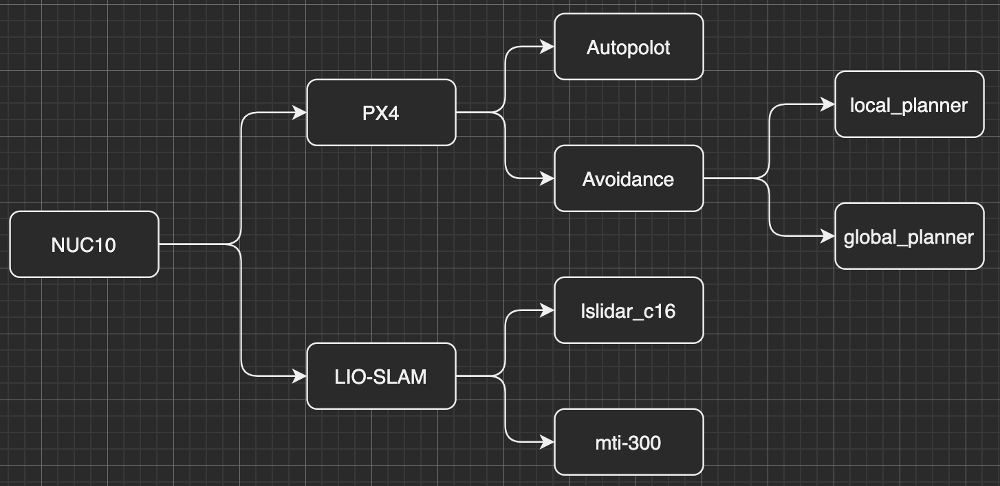
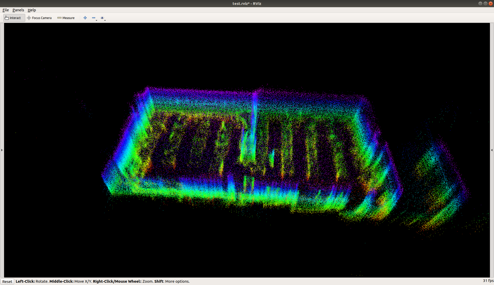
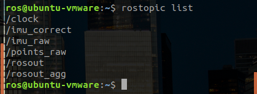
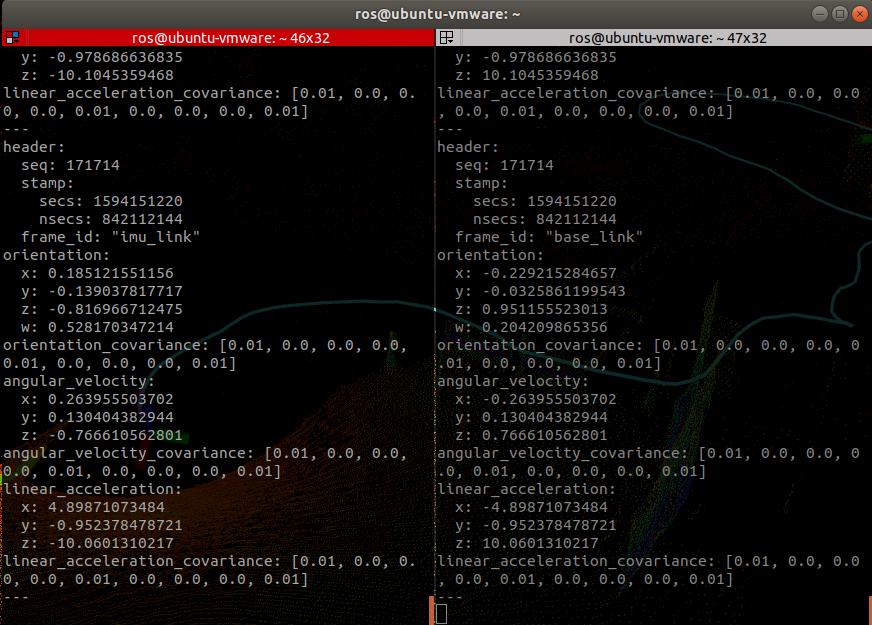
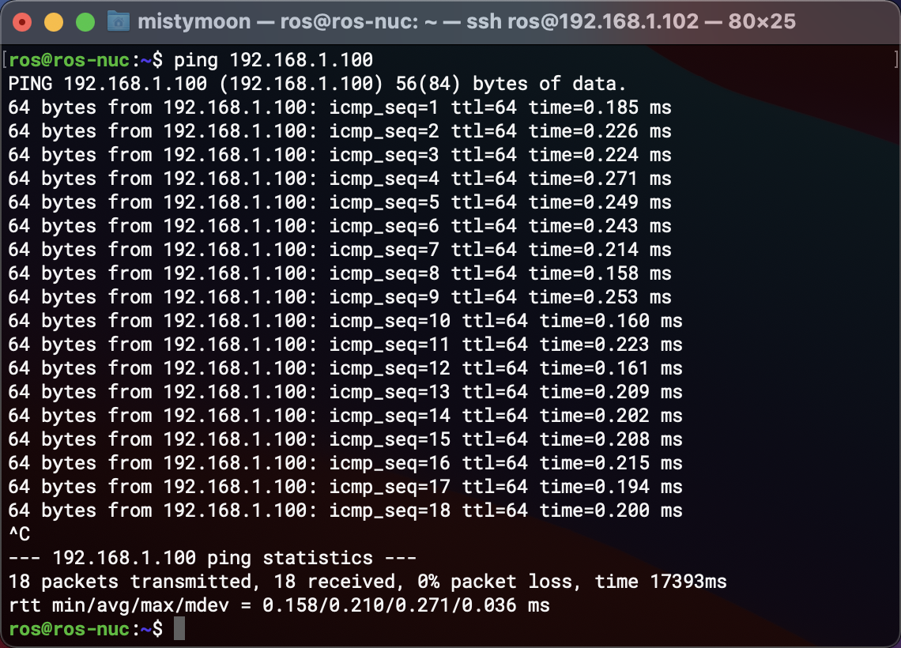
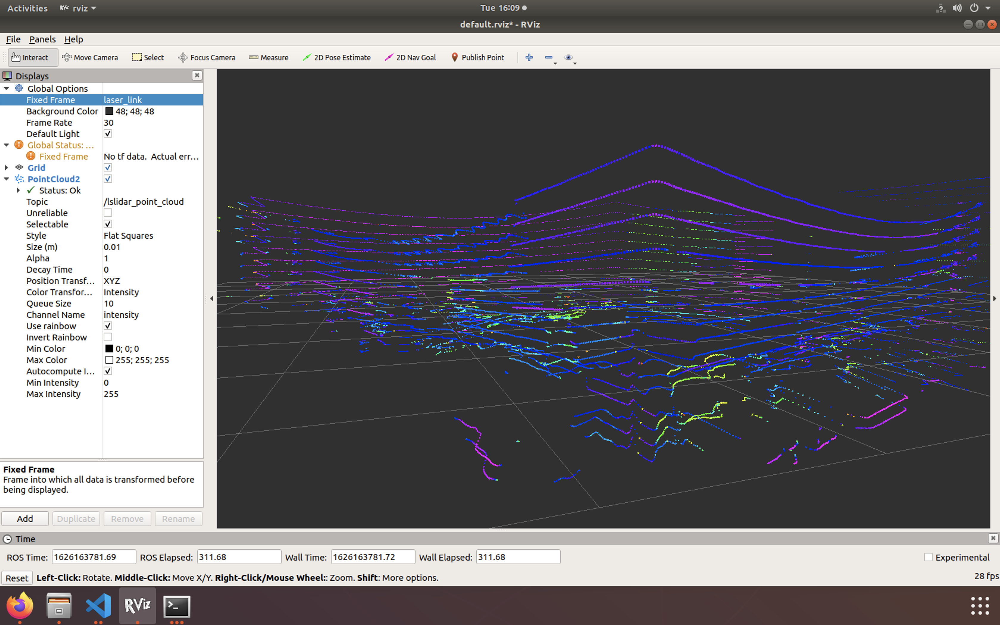
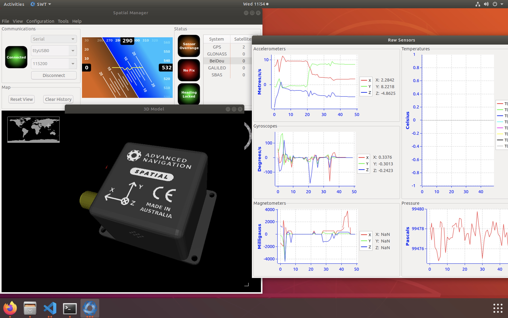

# SLAM

系统环境： 
- Ubuntu18.04.5 LTS x86_64 
- Kernel: 5.4.0-80-generic
- ROS melodic 1.14.11

硬件：
- NUC8 i7-8650U & NUC10 i7-10710U
- Advanced Navigation Spatial + Tallysman GPS(已经放弃: ROS包没加速度计)
- 镭神激光雷达 C16
- Xsens Mti-300
- 路由器: AR750S
- 飞控: PX4
----

传送门: 
* [velodyne(可选)](data/Velodyne_16.md)
* [lslidar_c16](data/lslidar_c16.md)
* [advanced_navigation_driver](data/Spatial.md)
* [xsens Mti-300](data/MTi-300.md)

问题：

- [x] Spatial 九轴陀螺仪有ROS包，官方(MIT)提供的包发现CPU占用过高，Github上有另外fork，但是放到ROS_ws编译不通过，先放着(放弃)
- [x] IMU和激光雷达数据融合

**目前进度:** 准备把SLAM搬到无人机上    

## 系统框架图



----
ubuntu中文输入法方法: [Ubuntu 18.04 配置ibus中文拼音输入法](https://blog.csdn.net/wu10188/article/details/86540464)


## SLAM部分

切换LIO-SAM算法用Ouster 数据包成功, 不知如何设置分辨率,而且映射也是有问题

### lego slam测试
初步测试不怎么理想, IMU容易飘, 有空再做测试


### lio slam测试

切换lio slam用屋顶数据集测试发现多了一个rostopic 发布话题 `/imu_correct` 经过研究发现这是用于转换的数据,bag里面带上不知原因   



经过研究发现lio slam内部带一个imu参数转换 (这么贴心)



参数如下

``` bash
  # Extrinsics (lidar -> IMU)
  extrinsicTrans: [0.0, 0.0, 0.0]
  extrinsicRot: [-1, 0, 0,
                  0, 1, 0,
                  0, 0, -1]
  extrinsicRPY: [0,  1, 0,
                 -1, 0, 0,
                  0, 0, 1]
```

搬到NUC10上测试发现lio_sam_imuPreintegration问题

解决方案: https://githubmemory.com/repo/TixiaoShan/LIO-SAM/issues/247

``` bash
#纯手敲，建议自行tab补全
sudo cp /usr/local/lib/libmetis.so /opt/ros/melodic/lib
```
PS: 这个地方贼迷惑，编译要/usr，跑起来要/opt,换句话说 两边缺一不可(感觉挺合适埋雷进去)

----
脚本问题解决
``` bash
sed -i "s/\r//" xxx.sh
```

下载 + 编译
``` bash
git clone xxxx

cd  #到~/home下
mkdir -p ROS_ws/src
cd ROS_ws/src
catkin_init_workspace
mv xxxx #把code里面的src拷贝过去
cd ..
catkin_make
```

----
IMU 可视化 测试工具: 
https://github.com/ccny-ros-pkg/imu_tools

``` bash
mkdir -p ~/imu_tools_ws/src && cd ~/imu_tools_ws/src

git clone https://github.com/ccny-ros-pkg/imu_tools.git

cd ..

##编译前 注释 PLUGINLIB_DECLARE_CLASS

catkin_make

source devel/setup.bash

echo "source ~/imu_tools_ws/devel/setup.bash" >> ~/.bashrc
``` 
----
路由器到手，测一下延迟。结论: 过路由和直连延迟都差不多，看来是有硬件加速...




----

## rosbag的用法
https://www.jianshu.com/p/6dd2c08d688e      


| 命令       | 作用                                                  |
| :--------- | :---------------------------------------------------- |
| check      | 确定一个包是否可以在当前系统中进行,或者是否可以迁移。 |
| decompress | 压缩一个或多个包文件。                                |
| filter     | 解压一个或多个包文件。                                |
| fix        | 在包文件中修复消息,以便在当前系统中播放。             |
| help       | 获取相关命令指示帮助信息                              |
| info       | 总结一个或多个包文件的内容。                          |
| play       | 以一种时间同步的方式回放一个或多个包文件的内容。      |
| record     | 用指定主题的内容记录一个包文件。                      |
| reindex    | 重新索引一个或多个包文件。                            |


| 命令            | 作用                 |
| :-------------- | :------------------- |
| -r              | 速率                 |
| -l              | 循环loop             |
| --topic /topic1 | 只播放选择topic      |
| --pause         | 开始暂停,空格恢复    |
| -a              | record 记录所有topic |


----


[Velodyne激光雷达ROS](../data/Velodyne_16.md)(可选)
  
----

## 首先需要安装环境 (重要)

[开发环境 安装 步骤](../Development-environment.md) 

----

## 镭神激光雷达包
来源： https://github.com/tianb03/lslidar_c16

测试：  

``` bash
roslaunch lslidar_c16_decoder lslidar_c16.launch --screen    
```
需要把 `Global Options` 中修改为 `/laser_link`



----

## 九轴IMU - Spatial:     
Official website: [Spatial](https://www.advancednavigation.com/products/spatial)        
ROS wiki: [advanced_navigation_driver](http://wiki.ros.org/advanced_navigation_driver) 

ROS:         
http://wiki.ros.org/advanced_navigation_driver  (CPU占用过高)  
https://github.com/kylerlaird/advanced_navigation_driver (编译不通过)  

测试: 
``` bash
rosrun advanced_navigation_driver advanced_navigation_driver
``` 
[`Advanced Navigation ROS Driver Notes.txt`](code/ROS_ws/src/unitree_ros/advanced_navigation_driver/Advanced-Navigation-ROS-Driver-Notes.txt) 在 `/ROS_ws/src/unitree_ros/advanced_navigation_driver` 里面有详细介绍


**Advanced Navigation 提供的JAR工具包**

文件: [`SpatialManager-5.8.jar`](../data/Spatial/SpatialManager-5.8.jar)
``` bash
sudo java -jar SpatialManager-5.8.jar 
``` 



----
# IMU的坐标变换 TF
看起来应该要依附某种东西比如激光雷达身上才能做一个坐标

单独IMU只能发布数据(echo)

BLOG: [32线镭神雷达跑LeGO-LOAM：3D 激光SLAM](https://blog.csdn.net/weixin_44208916/article/details/106094490)

