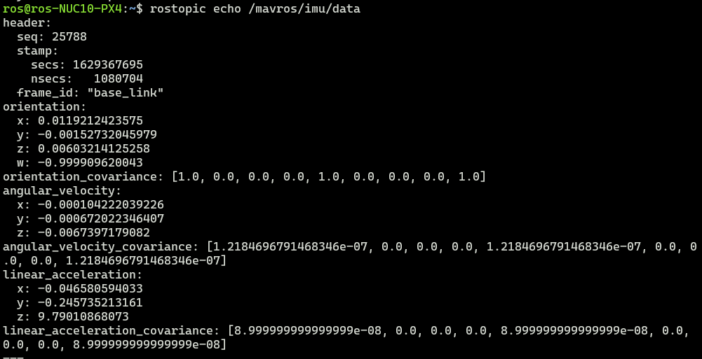

# SLAM

系统环境： 
- Ubuntu18.04.5 LTS x86_64 
- Kernel: 5.4.0-80-generic
- ROS melodic 1.14.11

硬件：
- NUC8 i7-8650U & NUC10 i7-10710U
- Advanced Navigation Spatial + Tallysman GPS(已经放弃: ROS包没加速度计)
- 镭神激光雷达 C16
- Xsens Mti-300
- 路由器: AR750S
- 飞控: PX4
----

传送门: 
* [velodyne(可选)](data/Velodyne_16.md)
* [lslidar_c16](data/lslidar_c16.md)
* [advanced_navigation_driver](data/Spatial.md)
* [xsens Mti-300](data/MTi-300.md)


**目前进度:** 终.

----

## SLAM部分

### lego slam测试
初步测试不怎么理想, IMU容易飘, 有空再做测试


### lio slam测试

切换lio slam用屋顶数据集测试发现多了一个rostopic 发布话题 `/imu_correct` 经过研究发现这是用于转换的数据,bag里面带上不知原因   


经过研究发现lio slam内部带一个imu参数转换 (这么贴心)


参数如下

``` bash
  # Extrinsics (lidar -> IMU)
  extrinsicTrans: [0.0, 0.0, 0.0]
  extrinsicRot: [-1, 0, 0,
                  0, 1, 0,
                  0, 0, -1]
  extrinsicRPY: [0,  1, 0,
                 -1, 0, 0,
                  0, 0, 1]
```

----
路由器到手，测一下延迟。结论: 过路由和直连延迟都差不多，看来是有硬件加速...


----

## rosbag的用法
https://www.jianshu.com/p/6dd2c08d688e      

详细参考 [rosbag](data/rosbag.md) 文档

## 终.
无人机起飞, 运行 `PX4-SLAM-record.sh` 脚本记录
``` bash
rosbag record /lslidar_pointcloud_c16 /mavros/imu/data /mavros/gpsstatus/gps1/raw
```

----
# PX4 

## Mavros 部分

### IMU
测试过程中意外发现PX4飞控里面自带九轴IMU
```
/mavros/imu/data
```



### GPS数据
```
/mavros/gpsstatus/gps1/raw
```


### topic


# SLAM

镭神激光雷达
```
/lslidar_pointcloud_c16
```

## rosbag 体积计算   
`stat`    
SIZE单位 Byte      
转换GB 除以 : 1073741824

>1字节(Byte)=8位(bit)     
>1KB( Kilobyte，千字节)=1024B    
>1MB( Megabyte，兆字节)=1024KB     
>1GB( Gigabyte，吉字节，千兆)=1024MB   


----

----
# IMU的坐标变换 TF
看起来应该要依附某种东西比如激光雷达身上才能做一个坐标

单独IMU只能发布数据(echo)

BLOG: [32线镭神雷达跑LeGO-LOAM：3D 激光SLAM](https://blog.csdn.net/weixin_44208916/article/details/106094490)

